# NarrativeOS

> **An AI-powered Path Intelligence Operating System for prediction markets.**
>
> NarrativeOS turns live SoSoValue market intelligence into structured, evidence-backed Path Contracts: multi-step futures that users can review, publish, and trade on testnet.

<p align="center">
  
</p>

<p align="center">
  <a href="https://narrativeos-orpin.vercel.app"></a>
  <a href="https://narrativeos-api.onrender.com/health"></a>
  <a href="https://github.com/himanshukaushik9813/narrativeos"></a>
  
  
  
  
  
</p>

---

## Live Surfaces

| Surface | URL | Status |
|---|---:|---|
| Product UI | [https://narrativeos-orpin.vercel.app](https://narrativeos-orpin.vercel.app) | Live on Vercel |
| API Health | [https://narrativeos-api.onrender.com/health](https://narrativeos-api.onrender.com/health) | Live on Render |
| Top Narratives | [https://narrativeos-api.onrender.com/api/narratives/top](https://narrativeos-api.onrender.com/api/narratives/top) | Live SoSoValue-backed response |
| Repository | [github.com/himanshukaushik9813/narrativeos](https://github.com/himanshukaushik9813/narrativeos) | Public |
| Settlement Contract | `0xc9f3bcb09b41057a105A7b0598962D8738c4cf8A` | Arbitrum Sepolia |

> [!IMPORTANT]
> NarrativeOS is intentionally strict about data provenance. The MVP uses live SoSoValue feeds for market intelligence and does **not** fabricate unavailable market data. If a required API key, RPC, or contract address is missing, the system fails closed and surfaces a configuration state.

---

## Quick Start For Judges

If you have five minutes, review the project in this order:

| Step | What To Open | What It Demonstrates |
|---:|---|---|
| 1 | [Live UI](https://narrativeos-orpin.vercel.app) | Production-deployed market terminal |
| 2 | [Top Narratives API](https://narrativeos-api.onrender.com/api/narratives/top) | Live SoSoValue evidence pipeline |
| 3 | `/build` route in the UI | Custom Path Contract creation |
| 4 | Evidence Drawer | Source-linked Market DNA |
| 5 | Agent Timeline | Transparent agent reasoning |
| 6 | `contracts/src/PathMarket.sol` | On-chain Path Contract primitive |

The fastest way to understand the project:

```text
SoSoValue evidence
  -> narrative agents
  -> structured Path Contract
  -> user review
  -> Arbitrum Sepolia settlement
  -> oracle evidence hash
```

---

## Cinematic Hero

**Prediction markets today ask users to bet on isolated events.**

NarrativeOS asks a more institutional question:

> What if the market could trade the entire chain of causality?

Not:

```text
Will BTC be above $100k by Friday?
```

But:

```text
Iran escalates conflict
  -> oil trades above $100
  -> risk assets compress
  -> BTC falls below $90k
```

NarrativeOS converts emerging market narratives into structured **Path Contracts**: ordered, multi-leg theses backed by live evidence, agent scoring, and on-chain settlement.

It is built to feel like:

```text
Palantir decision systems
  x OpenAI agent orchestration
  x Polymarket market creation
  x Bloomberg Terminal signal density
```

---

## Why NarrativeOS Exists

Markets are no longer moved by single events. They are moved by **narratives that unfold across time**.

An ETF inflow does not matter in isolation. It matters when it appears alongside news velocity, liquidity rotation, token attention, macro regime shifts, and crowd positioning. The modern trader is not only asking whether an event will happen. They are asking whether a sequence of conditions is forming into a durable path.

Current prediction markets compress that complexity into binary questions. That is useful, but incomplete.

NarrativeOS exists to make market structure more expressive:

| Old Primitive | New Primitive |
|---|---|
| Single event | Multi-step path |
| Binary outcome | Ordered thesis |
| Human-written market | AI-generated instrument |
| Weak evidence context | Source-linked evidence graph |
| Static odds | Agent-scored narrative intelligence |
| One-off bet | Portfolio of future paths |

---

## The Problem With Current Prediction Markets

Prediction markets are powerful, but their dominant UX still looks like a list of isolated propositions.

| Problem | Why It Matters |
|---|---|
| Events are isolated | Real markets move through causal chains, not single statements. |
| Market creation is manual | High-quality market writing requires research, structure, and settlement design. |
| Evidence is fragmented | Users must leave the platform to validate why a market exists. |
| Settlement logic is opaque | Many markets hide the operational complexity of oracle resolution. |
| No native narrative memory | Platforms rarely preserve how a thesis formed, changed, and resolved. |
| Limited composability | A trader cannot easily express "if A, then B, then C" as one instrument. |

NarrativeOS addresses this by introducing a new market primitive: the **Path Contract**.

---

## What Is A Path Market?

A Path Market is a market for a **sequence of future states**.

Instead of trading one outcome, users trade whether a structured narrative completes.

```text
Leg 1: BTC spot ETF daily net inflow remains positive
Leg 2: BTC spot ETF 3-day net inflow holds above baseline
Leg 3: BTC remains a matched currency in SoSoValue featured news
Settlement: path succeeds if each leg confirms in order
```

In investor language:

> A Path Market is a path-dependent prediction instrument for narrative-driven markets.

In product language:

> It is a way to trade an entire thesis, not a single headline.

In protocol language:

> It is an on-chain contract that stores a terms hash, accepts leg-level positions, and resolves sequential oracle evidence.

---

## Real Narrative Path Examples

### 1. Geopolitical Risk Path

```text
Iran escalates conflict
  -> Brent crude trades above $100
  -> crypto risk appetite contracts
  -> BTC falls below $90k
```

### 2. Bitcoin ETF Momentum Path

```text
BTC spot ETF daily net inflow remains positive
  -> 3-day cumulative inflow expands
  -> BTC remains dominant in SoSoValue matched-currency news
```

### 3. Ethereum Rotation Path

```text
ETH ETF flow improves
  -> Ethereum ecosystem narratives accelerate
  -> ETH becomes a persistent SoSoValue matched currency
```

### 4. Regulation Narrative Path

```text
CLARITY Act news velocity increases
  -> regulatory market attention persists
  -> crypto policy narrative remains category-dominant
```

### 5. AI Infrastructure Rotation Path

```text
AI token news velocity rises
  -> matched currencies cluster around AI infrastructure
  -> ETF / liquidity evidence supports risk-on continuation
```

> [!NOTE]
> The current MVP only generates and settles structures supported by available live evidence. It does not invent unavailable SoSoValue endpoints, whale data, social data, or private market feeds.

---

## Product Snapshot

| Capability | MVP Status |
|---|---|
| Live SoSoValue featured news ingestion | Implemented |
| SoSoValue listed currencies ingestion | Implemented |
| SoSoValue current ETF metrics | Implemented |
| SoSoValue historical ETF inflow chart | Implemented |
| SoDEX spot/perps endpoint surface | Implemented as API context |
| AI narrative agent pipeline | Implemented |
| Evidence-backed path generation | Implemented |
| Custom Path Contract builder | Implemented |
| Agent Pipeline Timeline | Implemented |
| Evidence Drawer | Implemented |
| Review and Publish flow | Implemented |
| On-chain PathMarket contract | Implemented |
| Arbitrum Sepolia settlement | Implemented |
| Oracle leg resolution API | Implemented |
| Wallet testnet staking/order flow | Implemented |
| Production frontend deployment | Vercel |
| Production backend deployment | Render |

---

## Screenshots

> Replace these placeholders with final screenshots from the deployed app.

| Market Terminal | Path Builder |
|---|---|
| 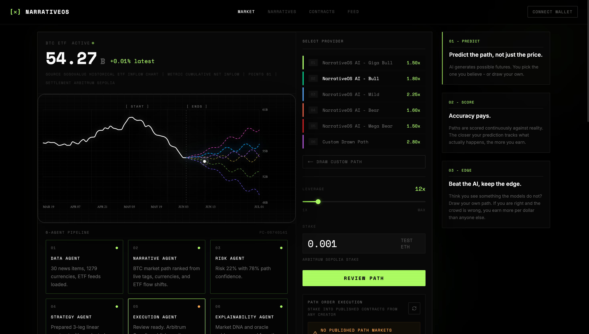 | 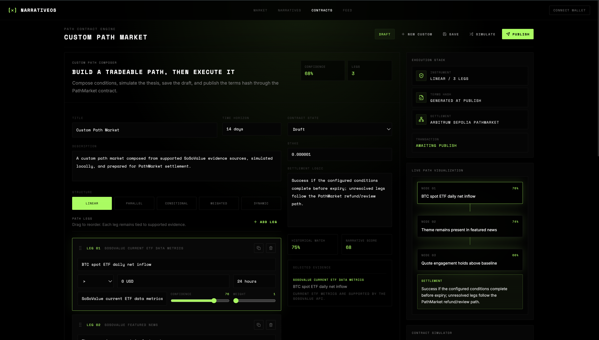 |

| Evidence Drawer | Agent Timeline |
|---|---|
|  |  |

---

## Demo GIF Placeholders

| Demo | Asset |
|---|---|
| Boot sequence into terminal | `docs/assets/gifs/boot-sequence.gif` |
| Live SoSoValue narrative detection | `docs/assets/gifs/live-narratives.gif` |
| Generate Path Contract | `docs/assets/gifs/generate-path.gif` |
| Publish and stake on testnet | `docs/assets/gifs/publish-stake.gif` |
| Evidence and oracle review | `docs/assets/gifs/evidence-oracle.gif` |

---

## Animated SVG Banner Suggestions

Suggested banner asset: `docs/assets/narrativeos-banner.svg`

Design direction:

```text
black background
faint green radial glow
thin terminal grid
animated path nodes
SoSoValue signal particles
NARRATIVEOS wordmark
subtitle: Path Intelligence for Prediction Markets
```

Suggested SVG layers:

| Layer | Motion |
|---|---|
| Background grid | Slow opacity breathing |
| Signal particles | Horizontal drift |
| Path nodes | Sequential pulse |
| Terminal scanline | Slow vertical sweep |
| Wordmark | Subtle green edge glow |

---

## Architecture

NarrativeOS is a monorepo with three major execution domains:

```text
apps/web       -> Next.js App Router frontend
services/api   -> FastAPI backend and agent pipeline
contracts      -> Solidity PathMarket contract and Foundry tests
```

### System Architecture

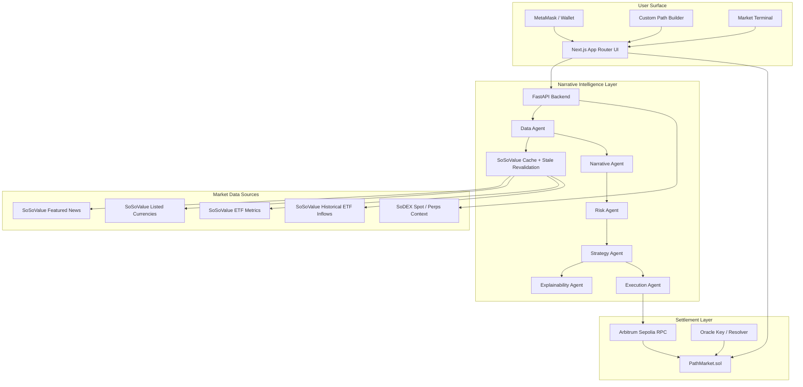

### Repository Architecture

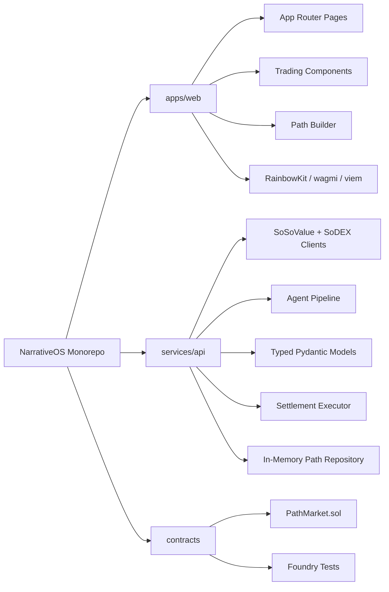

---

## System Flow

### Live Narrative Detection

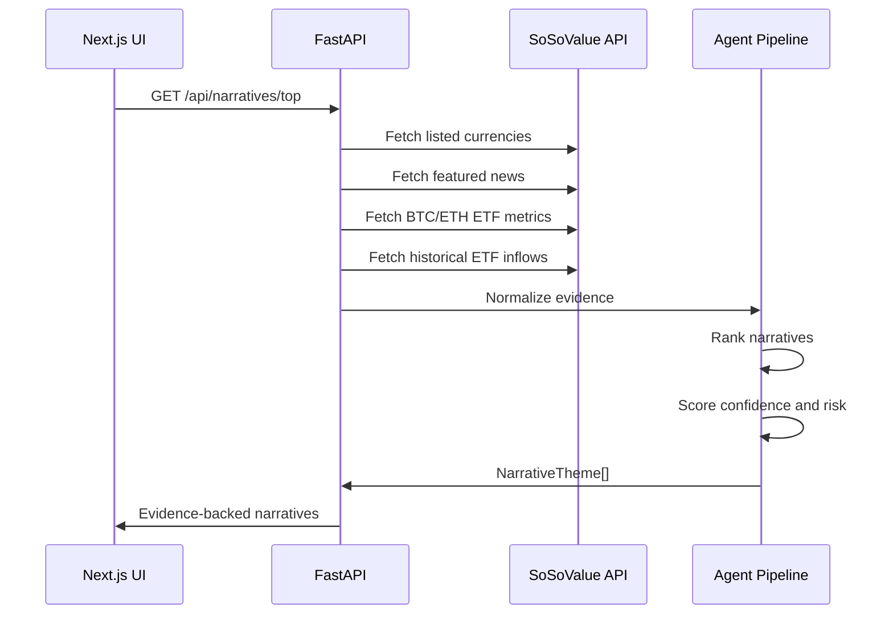

### Path Contract Generation

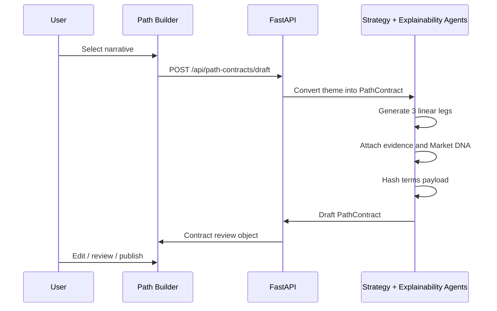

### Publish And Stake Flow

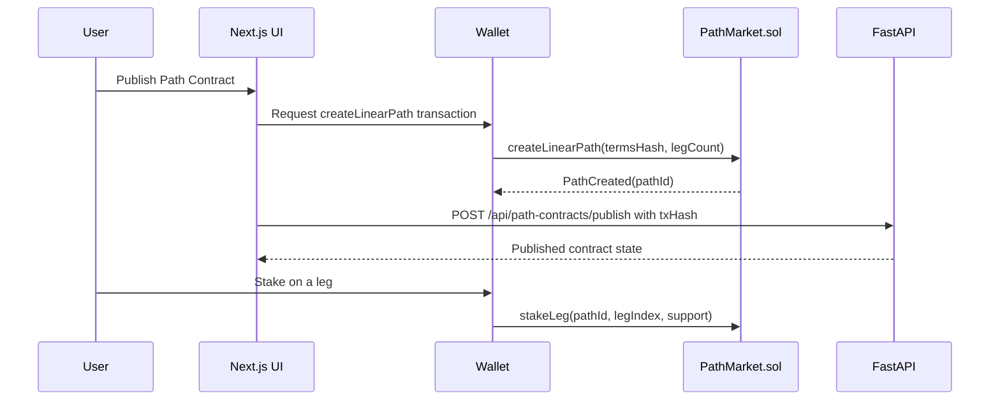

### Oracle Settlement Flow

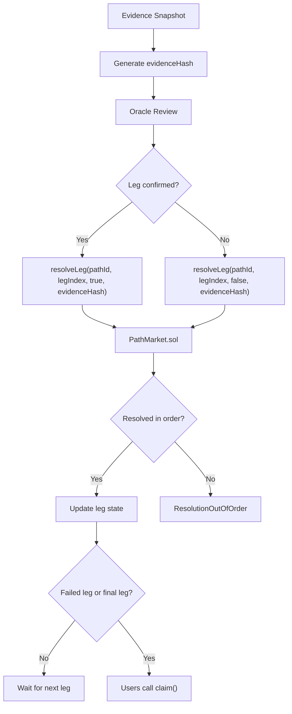

---

## AI Agent Architecture

NarrativeOS uses a deterministic, inspectable agent pipeline. The MVP does not hide behind vague "AI magic"; it appends a typed `AgentContext` as evidence moves through the system.

### Agent Roles

| Agent | Responsibility | Output |
|---|---|---|
| Data Agent | Fetch supported SoSoValue feeds and normalize evidence | Source inventory, snapshot time |
| Narrative Agent | Rank themes from tags, matched currencies, ETF flow context | Top narrative IDs and confidence |
| Risk Agent | Compute risk from confidence and evidence breadth | Theme-level risk |
| Strategy Agent | Convert narratives into v1 3-leg linear Path Contracts | Legs, thresholds, time windows |
| Execution Agent | Prepare publish / settlement context | Chain, tx hash, on-chain path ID |
| Explainability Agent | Generate Market DNA from cited evidence | Human-readable thesis explanation |

### Agent Scoring Model

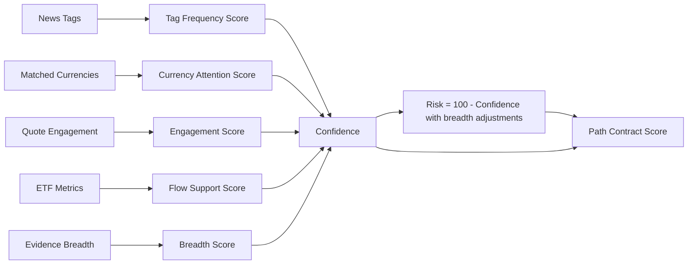

### Agent Credibility Scoring

NarrativeOS treats agents as accountable analysts. Each generated contract carries a score trail so users can inspect why the system believes a path is credible.

| Credibility Input | Source | Impact |
|---|---|---|
| Evidence breadth | Count of cited SoSoValue evidence items | Higher breadth improves confidence |
| Source persistence | Repeated tags / matched currencies across featured news | Repeated appearances increase narrative durability |
| Flow support | SoSoValue BTC / ETH ETF metrics and historical inflow chart | Flow alignment strengthens thesis quality |
| Engagement signal | SoSoValue `quoteInfo`-derived interaction context | Stronger engagement improves magnitude |
| Contradiction discount | Weak breadth, stale signals, or cooling flows | Lowers confidence and raises risk |
| Settlement clarity | Whether each leg maps to a supported evidence source | Improves publish readiness |

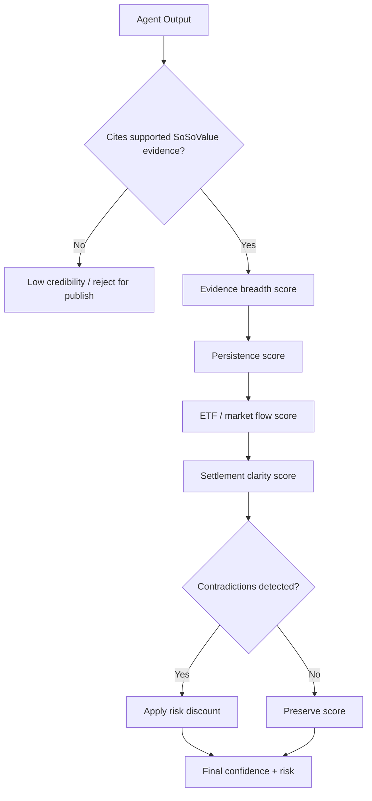

The MVP scoring model is intentionally legible. It is not a black-box trading model; it is a transparent narrative underwriting system.

### AgentContext Shape

```json
{
  "snapshotTime": "2026-06-04T17:29:18+00:00",
  "dataAgent": {
    "currencies": 1234,
    "featuredNews": 30,
    "etfFeeds": ["us-btc-spot", "us-eth-spot"]
  },
  "narrativeAgent": {
    "rankedThemeIds": ["tag-clarity-act", "currency-btc"],
    "dominantTheme": "CLARITY ACT narrative path"
  },
  "riskAgent": {
    "riskModel": "100 - confidence, adjusted by evidence breadth"
  },
  "strategyAgent": {
    "supportedStructure": "linear",
    "legCount": 3
  },
  "executionAgent": {
    "mode": "wallet",
    "status": "submitted"
  },
  "explainabilityAgent": {
    "style": "Market DNA",
    "evidenceRule": "Only supported SoSoValue endpoints are cited."
  }
}
```

---

## SoSoValue Intelligence Layer

SoSoValue is the core evidence engine of NarrativeOS.

The MVP integrates:

| SoSoValue Feed | Usage |
|---|---|
| Listed currencies | Market universe and currency context |
| Featured news | Narrative detection, tag frequency, matched currency evidence |
| Featured news by currency | Currency-specific intelligence surface |
| Current ETF data metrics | ETF flow conditions |
| Historical ETF inflow chart | Market chart and threshold baselines |

### SoSoValue Request Boundary

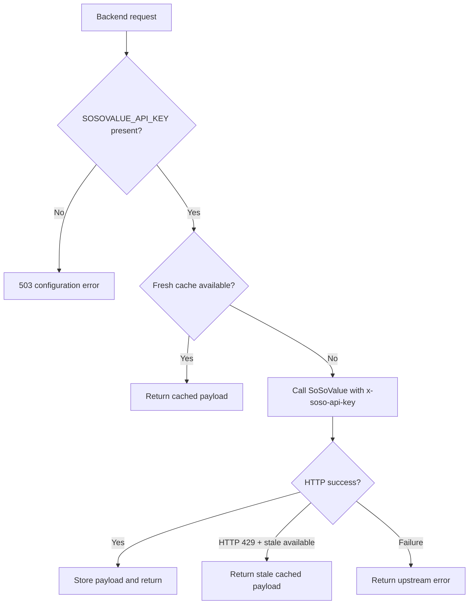

> [!WARNING]
> NarrativeOS does not include seeded market narratives, fake whale data, fake social data, or fictional SoDEX Path endpoints. Unsupported data remains unavailable until a real public source is integrated.

---

## SoDEX Integration Boundary

SoDEX is included as a market context surface for spot/perps endpoints and account state. The MVP keeps this integration truthful:

| Area | Status |
|---|---|
| SoDEX spot endpoint configuration | Implemented |
| SoDEX perps endpoint configuration | Implemented |
| Spot symbols API route | Implemented |
| Account state API route | Implemented |
| Path Contract publishing through SoDEX | Not claimed |
| Path Contract settlement | Arbitrum Sepolia EVM contract |

NarrativeOS does **not** invent a SoDEX Path Contract endpoint. Path Contracts are published through the deployed EVM `PathMarket` contract.

---

## Smart Contract Architecture

The MVP settlement primitive is `PathMarket.sol`.

### Contract Responsibilities

| Function | Purpose |
|---|---|
| `createLinearPath(bytes32 termsHash, uint8 legCount)` | Creates a new path with immutable off-chain terms hash |
| `stakeLeg(uint256 pathId, uint8 legIndex, bool support)` | Lets users support or oppose a specific leg |
| `resolveLeg(uint256 pathId, uint8 legIndex, bool confirmed, bytes32 evidenceHash)` | Oracle-only sequential leg resolution |
| `claim(uint256 pathId)` | Graduated per-leg payout and unresolved-leg refund behavior |
| `setOracle(address nextOracle)` | Owner-managed oracle rotation |

### Contract Data Model

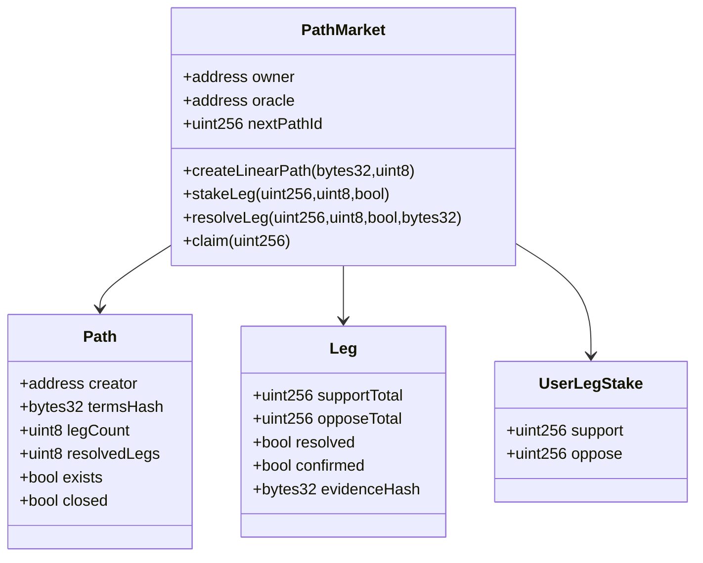

### Settlement Properties

| Property | Mechanism |
|---|---|
| Ordered resolution | `legIndex == path.resolvedLegs` |
| Oracle restriction | `onlyOracle` modifier |
| Immutable terms pointer | `termsHash` |
| Evidence anchoring | `evidenceHash` per resolved leg |
| Early failure closure | Path closes on first failed leg |
| Graduated payout | Winners receive principal plus proportional loser pool |
| Unresolved refunds | Unresolved legs refund both sides after closure |

### Contract Events

| Event | Meaning |
|---|---|
| `PathCreated` | A path was created with terms hash and leg count |
| `LegStaked` | User staked support or opposition on a leg |
| `LegResolved` | Oracle resolved a leg with evidence hash |
| `Claimed` | User claimed payout/refund |
| `OracleUpdated` | Oracle signer changed |

---

## API Documentation

Base URL:

```text
https://narrativeos-api.onrender.com
```

### Health

```http
GET /health
```

Response:

```json
{
  "ok": true,
  "timestamp": "2026-06-04T17:29:15+00:00"
}
```

### Top Narratives

```http
GET /api/narratives/top
```

Returns live SoSoValue-backed narratives.

```json
{
  "narratives": [
    {
      "id": "tag-clarity-act",
      "title": "CLARITY ACT narrative path",
      "confidence": 81,
      "risk": 19,
      "evidence": [
        {
          "source": "SoSoValue featured news",
          "label": "U.S. Senator Lummis...",
          "value": "tag=CLARITY ACT"
        }
      ]
    }
  ],
  "snapshotTime": "2026-06-04T17:29:18+00:00"
}
```

### Market Chart

```http
GET /api/market-chart?asset=btc&points=54&future_points=28
```

Returns ETF inflow chart data derived from SoSoValue historical ETF inflow feeds.

### Draft Path Contract

```http
POST /api/path-contracts/draft
Content-Type: application/json
```

```json
{
  "themeId": "currency-btc",
  "stakeAmount": "0.001",
  "creator": "0x..."
}
```

### Publish Path Contract

```http
POST /api/path-contracts/publish
Content-Type: application/json
```

Wallet-submitted mode:

```json
{
  "contract": {},
  "txHash": "0x...",
  "creator": "0x..."
}
```

Server-relay mode:

```json
{
  "contract": {},
  "relay": true
}
```

### List Path Contracts

```http
GET /api/path-contracts
GET /api/path-contracts?status=published
```

### Get Path Contract

```http
GET /api/path-contracts/{path_id}
```

### SoDEX Symbols

```http
GET /api/sodex/spot/symbols
```

### SoDEX Account State

```http
GET /api/sodex/accounts/{user_address}/state
```

### Oracle Resolve

```http
POST /api/oracle/resolve
Content-Type: application/json
```

```json
{
  "pathId": 4,
  "legIndex": 1,
  "confirmed": true,
  "evidenceHash": "0x..."
}
```

---

## Local Setup

### Prerequisites

| Tool | Version |
|---|---|
| Node.js | 20+ recommended |
| npm | 10+ recommended |
| Python | 3.12+ |
| Foundry | Latest stable |
| MetaMask | For wallet flows |

### Clone

```bash
git clone https://github.com/himanshukaushik9813/narrativeos.git
cd narrativeos
```

### Environment

Create local env files from `.env.example`.

```bash
cp .env.example .env
cp .env.example services/api/.env
cp .env.example apps/web/.env.local
```

Required production-grade variables:

```bash
SOSOVALUE_API_KEY=
SOSOVALUE_OPENAPI_BASE=https://openapi.sosovalue.com
SOSOVALUE_ETF_API_BASE=https://api.sosovalue.xyz
SOSOVALUE_CACHE_TTL_SECONDS=180
SOSOVALUE_STALE_TTL_SECONDS=1800

SODEX_SPOT_ENDPOINT=https://testnet-gw.sodex.dev/api/v1/spot
SODEX_PERPS_ENDPOINT=https://testnet-gw.sodex.dev/api/v1/perps

SETTLEMENT_CHAIN_NAME="Arbitrum Sepolia"
SETTLEMENT_CHAIN_ID=421614
SETTLEMENT_RPC_URL=https://sepolia-rollup.arbitrum.io/rpc
SETTLEMENT_EXPLORER_URL=https://sepolia.arbiscan.io
PATH_MARKET_CONTRACT_ADDRESS=
ORACLE_PRIVATE_KEY=

NEXT_PUBLIC_NARRATIVEOS_API_BASE=http://127.0.0.1:8000
NEXT_PUBLIC_API_BASE=http://127.0.0.1:8000
NEXT_PUBLIC_SETTLEMENT_CHAIN_NAME="Arbitrum Sepolia"
NEXT_PUBLIC_SETTLEMENT_CHAIN_ID=421614
NEXT_PUBLIC_SETTLEMENT_RPC_URL=https://sepolia-rollup.arbitrum.io/rpc
NEXT_PUBLIC_SETTLEMENT_EXPLORER_URL=https://sepolia.arbiscan.io
NEXT_PUBLIC_PATH_MARKET_CONTRACT_ADDRESS=
NEXT_PUBLIC_WALLETCONNECT_PROJECT_ID=
```

### Install Frontend

```bash
npm install
```

### Run Frontend

```bash
npm run web:dev
```

Frontend runs at:

```text
http://127.0.0.1:3000
```

### Run Backend

```bash
cd services/api
python3 -m venv .venv
. .venv/bin/activate
pip install -e ".[test]"
uvicorn narrativeos_api.main:app --reload --port 8000
```

Backend runs at:

```text
http://127.0.0.1:8000
```

### Run Contract Tests

```bash
cd contracts
forge test
```

---

## Deployment

### Frontend: Vercel

Current deployment:

```text
https://narrativeos-orpin.vercel.app
```

Production env required on Vercel:

```bash
NEXT_PUBLIC_NARRATIVEOS_API_BASE=https://narrativeos-api.onrender.com
NEXT_PUBLIC_API_BASE=https://narrativeos-api.onrender.com
NEXT_PUBLIC_SETTLEMENT_CHAIN_NAME="Arbitrum Sepolia"
NEXT_PUBLIC_SETTLEMENT_CHAIN_ID=421614
NEXT_PUBLIC_SETTLEMENT_RPC_URL=https://sepolia-rollup.arbitrum.io/rpc
NEXT_PUBLIC_SETTLEMENT_EXPLORER_URL=https://sepolia.arbiscan.io
NEXT_PUBLIC_PATH_MARKET_CONTRACT_ADDRESS=0xc9f3bcb09b41057a105A7b0598962D8738c4cf8A
NEXT_PUBLIC_WALLETCONNECT_PROJECT_ID=
```

Deploy:

```bash
npx vercel --prod
```

### Backend: Render

Current deployment:

```text
https://narrativeos-api.onrender.com
```

Render service:

```text
narrativeos-api
```

Render config:

```yaml
rootDir: services/api
buildCommand: pip install -e .
startCommand: uvicorn narrativeos_api.main:app --host 0.0.0.0 --port $PORT
healthCheckPath: /health
```

Production env required on Render:

```bash
SOSOVALUE_API_KEY=
SOSOVALUE_OPENAPI_BASE=https://openapi.sosovalue.com
SOSOVALUE_ETF_API_BASE=https://api.sosovalue.xyz
SOSOVALUE_CACHE_TTL_SECONDS=180
SOSOVALUE_STALE_TTL_SECONDS=1800
SODEX_SPOT_ENDPOINT=https://testnet-gw.sodex.dev/api/v1/spot
SODEX_PERPS_ENDPOINT=https://testnet-gw.sodex.dev/api/v1/perps
SETTLEMENT_CHAIN_NAME="Arbitrum Sepolia"
SETTLEMENT_CHAIN_ID=421614
SETTLEMENT_RPC_URL=https://sepolia-rollup.arbitrum.io/rpc
SETTLEMENT_EXPLORER_URL=https://sepolia.arbiscan.io
PATH_MARKET_CONTRACT_ADDRESS=0xc9f3bcb09b41057a105A7b0598962D8738c4cf8A
ORACLE_PRIVATE_KEY=
```

---

## Testing

### Frontend

```bash
npm run web:lint
npm run web:build
```

### Backend

```bash
cd services/api
pytest -q
```

### Contracts

```bash
cd contracts
forge test
```

### Live Integration Checks

Live tests require production-like env:

```bash
SOSOVALUE_API_KEY=... pytest -m live
```

---

## Benchmarking

Suggested benchmark dimensions:

| Benchmark | Metric |
|---|---|
| SoSoValue fetch latency | p50 / p95 response time |
| Narrative scoring time | milliseconds per pipeline run |
| Cache effectiveness | hit ratio under repeated UI refresh |
| Draft generation latency | time from theme selection to PathContract |
| Settlement preparation | transaction build time |
| Contract gas | create path, stake leg, resolve leg, claim |

Suggested benchmark command:

```bash
time curl -fsS https://narrativeos-api.onrender.com/api/narratives/top > /tmp/narratives.json
```

---

## Novel Contributions

### 1. Path Markets As A New Prediction Primitive

NarrativeOS extends prediction markets from isolated propositions into multi-leg thesis instruments.

### 2. Evidence-Backed Market Creation

Every generated path is tied to source evidence from supported SoSoValue endpoints.

### 3. Agent Context As Audit Trail

Instead of returning only a final answer, the system appends a structured `AgentContext` across the pipeline.

### 4. Terms Hash Separation

Rich market terms stay off-chain for UX and flexibility, while `termsHash` anchors them to the on-chain contract.

### 5. Sequential Oracle Settlement

Path resolution is order-sensitive. A failed early leg can close the path, matching real causal thesis failure.

### 6. Truthful Integration Boundary

The product explicitly refuses to fabricate missing data, fake endpoints, or unsupported market sources.

---

## Why This Is Different

| Platform | Core Primitive | Market Creation | Evidence Layer | Path-Dependent Settlement | AI Agents | On-Chain Contract |
|---|---|---|---|---|---|---|
| Polymarket | Single event market | Mostly human-authored | External / community | Limited | No native agent pipeline | Yes |
| Kalshi | Regulated event contract | Centralized listing | External / institutional | Limited | No native agent pipeline | No public crypto settlement |
| PredictIt | Political event market | Centralized listing | External | No | No | No |
| Manifold | Social prediction market | User-created | Social / informal | Limited | No native agent pipeline | No |
| **NarrativeOS** | **Multi-step Path Contract** | **AI-assisted and user-editable** | **SoSoValue evidence graph** | **Yes** | **Yes** | **Yes, Arbitrum Sepolia MVP** |

---

## For Judges

NarrativeOS is technically difficult because it combines multiple hard systems into one coherent protocol surface:

| Difficulty | Why It Is Hard |
|---|---|
| Live data ingestion | SoSoValue data must be normalized, cached, and cited without fabricating fallback data. |
| Agent orchestration | Agents must preserve context across Data, Narrative, Risk, Strategy, Execution, and Explainability roles. |
| Financial UX | The interface must expose risk, confidence, settlement logic, and evidence without becoming a form builder. |
| Contract design | Path markets require ordered resolution, leg-level staking, and graduated payouts. |
| Oracle design | Settlement must anchor evidence hashes while preserving off-chain evidence richness. |
| Wallet integration | Users need to publish and stake from the UI on testnet. |
| Deployment | The MVP is deployed across Vercel, Render, Arbitrum Sepolia, and GitHub with separate env boundaries. |
| Honesty constraints | The product refuses to fake SoSoValue, SoDEX, or market data, which makes the demo harder but more credible. |

This is not a static dashboard. It is an end-to-end market creation and settlement system.

---

## Threat Model

| Threat | Risk | Mitigation In MVP |
|---|---|---|
| SoSoValue API outage | Narrative generation unavailable | Fail closed, show configuration/upstream error |
| SoSoValue rate limiting | Temporary 429 responses | Fresh cache and stale cache window |
| Oracle compromise | Malicious leg resolution | Oracle-only role is explicit; future roadmap includes multisig / optimistic challenge |
| Terms mismatch | UI terms differ from settlement terms | `termsHash` anchors contract payload |
| Evidence manipulation | Off-chain evidence could be misrepresented | Evidence hash stored on resolution; roadmap includes IPFS / content addressing |
| Smart contract bug | Incorrect payouts or locked funds | Foundry tests; MVP testnet only |
| RPC failure | Publish / resolve unavailable | Surface configuration or network error |
| Wallet user error | Wrong chain or wrong account | UI settlement chain labels and wallet checks |
| API key leakage | SoSoValue quota compromise | API key only server-side via FastAPI |

---

## Security Assumptions

The MVP assumes:

- SoSoValue responses are authoritative for supported evidence fields.
- The configured oracle signer acts honestly.
- Users understand Arbitrum Sepolia funds are testnet assets.
- Path terms are reviewed before signing transactions.
- Frontend public env vars are not secrets.
- `ORACLE_PRIVATE_KEY` and `SOSOVALUE_API_KEY` remain server-side only.
- `termsHash` correctly represents the contract terms shown to the user.

Production hardening should add:

- Oracle multisig
- Optimistic dispute window
- IPFS / Arweave evidence bundles
- Contract audits
- Replay-resistant signed off-chain terms
- Rate limit telemetry
- Circuit breakers for stale evidence windows

---

## Scalability Roadmap

### Phase 1: MVP Hardening

- Persist contracts in a real database
- Add contract indexing from Arbitrum events
- Add richer SoSoValue caching and request coalescing
- Add deterministic evidence bundles
- Add more UI test coverage

### Phase 2: Market Depth

- Add parallel, weighted, conditional, and dynamic path structures
- Add portfolio analytics
- Add path discovery and secondary market views
- Add liquidity provider workflows
- Add agent credibility history

### Phase 3: Oracle Network

- Add multisig oracle committee
- Add optimistic resolution challenges
- Add decentralized evidence storage
- Add public settlement dashboards

### Phase 4: Institutional Terminal

- Add narrative heatmaps
- Add cross-asset path correlation
- Add regime detection
- Add alerting
- Add desk-level watchlists
- Add API access for funds and researchers

---

## Future Vision

NarrativeOS can become the **Bloomberg Terminal for narrative intelligence**.

The long-term vision is an operating system where traders, researchers, protocols, and funds can:

- Detect live narratives before they become consensus
- Convert narratives into structured instruments
- Backtest path theses across historical regimes
- Trade complete future paths
- Build reputation around narrative accuracy
- Resolve market structure through transparent oracle evidence
- Create a programmable marketplace for causal market intelligence

The eventual product is not only a prediction market interface.

It is a protocol for turning information into structured, tradeable futures.

---

## Research Inspiration

NarrativeOS is inspired by:

- Prediction market design
- Path-dependent derivatives
- Narrative economics
- Agent-based decision systems
- Market microstructure
- Oracle settlement mechanisms
- Institutional research terminals
- Evidence graphs
- Causal inference workflows
- Open financial data infrastructure

Useful references and source boundaries:

| Area | Source |
|---|---|
| SoSoValue API authentication and endpoints | [SoSoValue API Docs](https://sosovalue.gitbook.io/soso-value-api-doc) |
| SoDEX API overview | [SoDEX Documentation](https://sodex.com/documentation/api/api) |
| Arbitrum Sepolia chain details | [Arbitrum Docs](https://docs.arbitrum.io/for-devs/dev-tools-and-resources/chain-info) |
| FastAPI | [FastAPI Documentation](https://fastapi.tiangolo.com/) |
| Next.js App Router | [Next.js Documentation](https://nextjs.org/docs) |
| Foundry | [Foundry Book](https://book.getfoundry.sh/) |

---

## Contributing

High-quality contributions are welcome.

Recommended contribution areas:

- SoSoValue evidence normalization
- Agent scoring models
- Path Contract structures
- Oracle evidence bundles
- Contract indexing
- UI polish
- Tests and benchmarks
- Documentation

Workflow:

```bash
git checkout -b feature/your-change
npm run web:lint
cd services/api && pytest -q
cd ../../contracts && forge test
git commit -m "Describe your change"
```

---

## Maintainer Notes

### Do Not Add Fake Data

This repository intentionally rejects fake runtime data. If a source is unavailable, expose that state clearly.

### Keep Integrations Truthful

Do not claim a SoDEX Path Contract endpoint unless it exists publicly.

### Keep Settlement Labels Honest

The MVP uses Arbitrum Sepolia testnet settlement. Do not label testnet stakes as mainnet funds.

### Protect Secrets

Never commit:

```text
SOSOVALUE_API_KEY
ORACLE_PRIVATE_KEY
Wallet private keys
RPC provider secrets
```

---

## License

This repository is currently provided for hackathon review and open-source evaluation. Add an explicit OSI-approved `LICENSE` file before external production reuse.

Recommended license for open-source release:

```text
MIT License
```

---

## Citations

```bibtex
@software{narrativeos_2026,
  title = {NarrativeOS: AI-Powered Path Intelligence Operating System for Prediction Markets},
  author = {Himanshu Kaushik},
  year = {2026},
  url = {https://github.com/himanshukaushik9813/narrativeos}
}
```

---

## Final Thesis

Prediction markets should not stop at single outcomes.

The future arrives as a sequence:

```text
signal
  -> narrative
  -> capital flow
  -> market repricing
  -> settlement
```

NarrativeOS is the operating system for that sequence.
